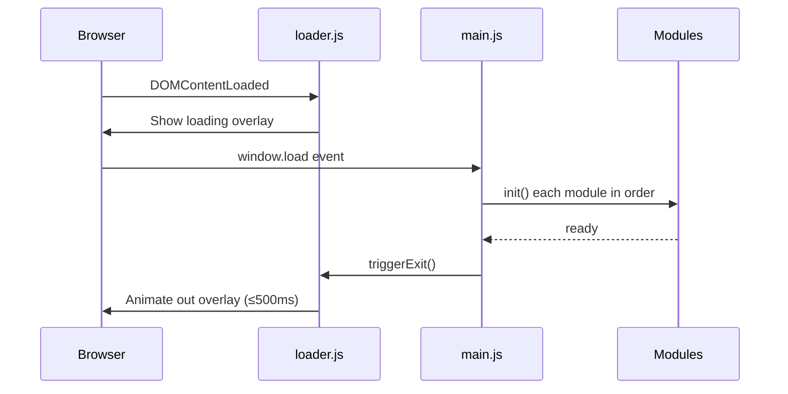

# Design Document: Personal Portfolio Website

## Overview

A premium, fully static personal portfolio website delivered as plain HTML5, CSS3, and JavaScript files — no build step, no bundler, no server required. The visitor opens `index.html` directly in a browser and experiences a cyberpunk / trading-dashboard / indie-game aesthetic with dark UI, glowing neon accents, glassmorphism cards, and GPU-accelerated animations.

### Technology Stack

| Concern | Choice | Delivery |
|---|---|---|
| Markup | HTML5 (semantic) | Local file |
| Styling | CSS3 (custom properties, Grid, Flexbox) | Local file |
| Core scripting | Vanilla JavaScript (ES2020 modules) | Local file |
| Scroll animations | [AOS 2.x](https://michalsnik.github.io/aos/) | CDN |
| Timeline / complex animations | [GSAP 3.x](https://gsap.com/) + ScrollTrigger plugin | CDN |
| 3D hero background | [Three.js r160](https://threejs.org/) | CDN |
| Charts | [Chart.js 4.x](https://www.chartjs.org/) | CDN |

All CDN links use the `crossorigin="anonymous"` attribute and a `defer` loading strategy to avoid render-blocking.

### Design Language

- **Color palette**: Deep navy/black backgrounds (`#0a0a0f`, `#0d1117`), cyan/teal primary glow (`#00f5ff`), magenta secondary glow (`#ff00ff`), amber accent (`#ffd700`)
- **Typography**: `Orbitron` (headings, cyberpunk feel) + `Rajdhani` (body, readable) — both via Google Fonts
- **Glassmorphism**: `backdrop-filter: blur(12px)` + semi-transparent backgrounds on cards and nav
- **Glow effects**: CSS `box-shadow` and `text-shadow` with neon colors; GSAP-driven pulse animations
- **Grid system**: CSS Grid for section layouts; Flexbox for component-level alignment

---

## Architecture

The site is a single HTML file (`index.html`) that references modular CSS and JS files. All logic is client-side.

```
project-root/
├── index.html              # Single entry point — all 10 sections
├── css/
│   ├── base.css            # Reset, custom properties, typography
│   ├── layout.css          # Grid/Flexbox layout helpers
│   ├── components.css      # Cards, buttons, cursor, nav, modals
│   ├── sections.css        # Per-section styles
│   ├── animations.css      # Keyframes, transition utilities
│   └── themes.css          # Dark/light theme variable overrides
├── js/
│   ├── main.js             # Entry point — initialises all modules
│   ├── loader.js           # Loading screen logic
│   ├── cursor.js           # Custom cursor tracking
│   ├── nav.js              # Navigation scroll-spy + hamburger
│   ├── hero.js             # Three.js particle system + typing animation
│   ├── threeWorlds.js      # Portal card tilt/glow interactions
│   ├── trading.js          # Chart.js chart initialisation
│   ├── projects.js         # Project card filter + tilt
│   ├── skillTree.js        # SVG skill tree rendering + tooltips
│   ├── timeline.js         # Timeline scroll animations
│   ├── terminal.js         # Easter egg terminal
│   └── theme.js            # Dark/light mode toggle + localStorage
├── assets/
│   ├── images/             # WebP/optimised screenshots, avatars
│   ├── icons/              # SVG tech stack icons
│   └── fonts/              # (optional local fallback fonts)
└── data/
    ├── projects.json       # Web project data
    ├── games.json          # Game portfolio data
    ├── skills.json         # Skill tree node data
    └── timeline.json       # Timeline entry data
```

### Module Initialisation Flow



### Data Flow

Content data (projects, games, skills, timeline entries) is stored in JSON files under `data/`. Each JS module fetches its JSON via `fetch()` on init and renders DOM nodes dynamically. This keeps `index.html` lean and makes content updates a JSON-only change.

---

## Components and Interfaces

### 1. Loading Screen (`loader.js`)

**Responsibility**: Display a branded fullscreen overlay while assets load; animate it out when ready.

**DOM structure**:
```html
<div id="loading-screen" aria-hidden="true">
  <div class="loader-logo"><!-- SVG or text logo --></div>
  <div class="loader-bar"><div class="loader-fill"></div></div>
  <div class="loader-text">Initialising...</div>
</div>
```

**Interface**:
```js
// loader.js
export function showLoader()   // called immediately on DOMContentLoaded
export function hideLoader()   // called by main.js after all modules init
```

**Behaviour**:
- A CSS `@keyframes` animation drives the progress bar fill
- A 5-second hard timeout calls `hideLoader()` regardless of module state (Requirement 1.4)
- `hideLoader()` adds class `loader--exit` which triggers a GSAP fade-out + scale-down

---

### 2. Custom Cursor (`cursor.js`)

**Responsibility**: Replace the browser cursor with a dual-ring cyberpunk cursor that tracks mouse position.

**DOM structure**:
```html
<div id="cursor-dot"></div>
<div id="cursor-ring"></div>
```

**Interface**:
```js
export function initCursor()
// Internally uses requestAnimationFrame for smooth 60fps tracking
// Adds/removes class 'cursor--hover' on interactive elements
```

**Behaviour**:
- `cursor-dot`: 8px solid circle, snaps to mouse position immediately
- `cursor-ring`: 32px ring, follows with a lerp (linear interpolation) delay for a trailing effect
- On `pointerenter` of `a, button, [role="button"]`: ring expands to 48px + changes color
- Touch detection: `window.matchMedia('(pointer: coarse)')` → hides both elements, restores `cursor: auto`

---

### 3. Navigation (`nav.js`)

**Responsibility**: Sticky nav with scroll-spy active state, glassmorphism on scroll, hamburger menu.

**DOM structure**:
```html
<nav id="main-nav" role="navigation" aria-label="Main navigation">
  <div class="nav-logo"><!-- name/logo --></div>
  <ul class="nav-links" role="list">
    <li><a href="#hero">Home</a></li>
    <!-- ... 9 more links ... -->
  </ul>
  <div class="nav-controls">
    <button id="theme-toggle" aria-label="Toggle theme"><!-- icon --></button>
    <button id="hamburger" aria-label="Open menu" aria-expanded="false"><!-- icon --></button>
  </div>
</nav>
```

**Interface**:
```js
export function initNav()
// Uses IntersectionObserver to track which section is in viewport
// Adds 'nav--scrolled' class when window.scrollY > 80
```

**Scroll-spy**: An `IntersectionObserver` with `threshold: 0.4` watches each `<section>`. When a section crosses the threshold, the corresponding nav link receives the `active` class.

---

### 4. Hero Section (`hero.js`)

**Responsibility**: Three.js particle system background + GSAP typing animation.

**Three.js Particle System**:
- Scene: `THREE.Scene` with `THREE.PerspectiveCamera`
- Geometry: `THREE.BufferGeometry` with 3000 random points
- Material: `THREE.PointsMaterial` with cyan color and `sizeAttenuation: true`
- Renderer: `THREE.WebGLRenderer` attached to `<canvas id="hero-canvas">`
- Animation loop: `requestAnimationFrame` rotates the point cloud slowly on Y-axis
- Resize handler: updates camera aspect + renderer size on `window.resize`

**Typing Animation**:
- Pure JS implementation using `setInterval`
- Cycles through `["Stock Trader", "Web Developer", "Game Maker"]`
- Types character-by-character, pauses, then deletes character-by-character
- Targets `<span id="typing-text">` inside the hero heading

---

### 5. Three Worlds Section (`threeWorlds.js`)

**Responsibility**: 3D tilt effect on portal cards using mouse position math.

**Tilt calculation**:
```js
// On mousemove over a card:
const rect = card.getBoundingClientRect()
const x = (event.clientX - rect.left) / rect.width  - 0.5  // -0.5 to 0.5
const y = (event.clientY - rect.top)  / rect.height - 0.5
card.style.transform = `perspective(600px) rotateY(${x * 20}deg) rotateX(${-y * 20}deg)`
```

**Glow**: CSS `box-shadow` transition on `:hover` + a GSAP `gsap.to()` that pulses the border color.

---

### 6. Trading Section (`trading.js`)

**Responsibility**: Render Chart.js charts with viewport-triggered animation.

**Charts**:
- Line chart: simulated equity curve (monthly P&L)
- Radar chart: strategy breakdown (momentum, mean-reversion, swing, options, crypto)

**Viewport trigger**: `IntersectionObserver` — when the section enters view, calls `chart.update()` with animation config `{ duration: 1200, easing: 'easeInOutQuart' }`.

---

### 7. Web Projects Section (`projects.js`)

**Responsibility**: Render project cards from JSON, implement category filter, 3D tilt.

**Filter logic**:
```js
// Each card has data-category="frontend|fullstack|tool|..."
// Filter buttons set data-active on themselves
// Cards not matching active filter get display:none + fade transition
```

**Tilt**: Same algorithm as Three Worlds cards (reusable `applyTilt(element)` utility).

---

### 8. Skill Tree Section (`skillTree.js`)

**Responsibility**: Render an SVG-based branching skill tree from `skills.json`.

**Rendering approach**:
- SVG drawn programmatically via `document.createElementNS`
- Nodes: `<circle>` + `<text>` groups positioned on a calculated grid
- Edges: `<line>` elements connecting parent → child nodes
- Proficiency: node fill opacity maps to skill level (0–100)
- Tooltip: a floating `<div>` positioned via `getBoundingClientRect()` on hover

**skills.json schema**:
```json
{
  "nodes": [
    { "id": "js", "label": "JavaScript", "level": 90, "parent": null, "category": "frontend" },
    { "id": "react", "label": "React", "level": 80, "parent": "js", "category": "frontend" }
  ]
}
```

---

### 9. Easter Egg Terminal (`terminal.js`)

**Responsibility**: Listen for the Konami-style sequence `t-e-r-m-i-n-a-l`, render a fake terminal overlay.

**Interface**:
```js
export function initTerminal()
// Listens on document keydown
// Maintains a rolling buffer of last N keypresses
// On match: animates terminal into view via GSAP
```

**Commands**:
| Command | Output |
|---|---|
| `whoami` | ASCII art name + role titles |
| `ls projects` | List of project names |
| `hack` | Fake "hacking" progress bar animation |
| `help` | List available commands |
| `exit` | Close terminal |

---

### 10. Theme Toggle (`theme.js`)

**Responsibility**: Switch CSS custom property values between dark and light themes; persist to `localStorage`.

**Implementation**:
```js
// themes.css defines:
// :root { --bg: #0a0a0f; --text: #e0e0e0; ... }
// [data-theme="light"] { --bg: #f0f4f8; --text: #1a1a2e; ... }

// theme.js:
document.documentElement.setAttribute('data-theme', 'light')  // or remove attr
localStorage.setItem('theme', 'light')
```

CSS `transition: background-color 300ms ease, color 300ms ease` on `:root` ensures the 300ms requirement is met.

---

## Data Models

### Project (`data/projects.json`)

```json
{
  "id": "string",
  "name": "string",
  "description": "string",
  "category": "frontend | fullstack | tool | game",
  "tags": ["string"],
  "liveUrl": "string | null",
  "githubUrl": "string | null",
  "imageUrl": "string"
}
```

### Game (`data/games.json`)

```json
{
  "id": "string",
  "title": "string",
  "description": "string",
  "screenshotUrl": "string",
  "playUrl": "string | null",
  "engine": "string",
  "devlogs": [
    { "date": "YYYY-MM-DD", "entry": "string" }
  ]
}
```

### Skill Node (`data/skills.json`)

```json
{
  "id": "string",
  "label": "string",
  "level": "number (0–100)",
  "parent": "string | null",
  "category": "string",
  "icon": "string (SVG path or emoji)"
}
```

### Timeline Entry (`data/timeline.json`)

```json
{
  "date": "string (e.g. 'Jan 2022')",
  "title": "string",
  "description": "string",
  "type": "trading | webdev | gamedev | education | milestone"
}
```

### Mission Card (inline in HTML or `data/missions.json`)

```json
{
  "id": "string",
  "title": "string",
  "status": "active | paused | completed",
  "description": "string",
  "progress": "number (0–100)"
}
```

---

## Correctness Properties

*A property is a characteristic or behavior that should hold true across all valid executions of a system — essentially, a formal statement about what the system should do. Properties serve as the bridge between human-readable specifications and machine-verifiable correctness guarantees.*

### Property 1: Theme persistence round-trip

*For any* theme value (`"dark"` or `"light"`), setting the theme and then reading it back from `localStorage` should return the same value, and the `data-theme` attribute on `<html>` should match.

**Validates: Requirements 14.4**

---

### Property 2: Contact form validation rejects incomplete submissions

*For any* combination of form field values where at least one required field (name, email, message) is empty or whitespace-only, submitting the form should not display a success message and should display at least one inline error message.

**Validates: Requirements 13.3**

---

### Property 3: Project filter invariant

*For any* active filter category, every visible Project_Card after filtering should have a `data-category` attribute that matches the active filter (or the filter is "all").

**Validates: Requirements 8.4**

---

### Property 4: Skill node data completeness

*For any* skill node rendered in the Skill_Tree_Section, the rendered DOM element should display both a label and a proficiency indicator derived from the source data node.

**Validates: Requirements 10.1, 10.2**

---

### Property 5: Typing animation cycles through all roles

*For any* complete cycle of the Typing_Animation, all three role titles ("Stock Trader", "Web Developer", "Game Maker") should appear in the `#typing-text` element before the cycle repeats.

**Validates: Requirements 2.2**

---

### Property 6: Terminal command response completeness

*For any* command in the supported command set (`whoami`, `ls projects`, `hack`, `help`, `exit`), the Easter_Egg_Terminal should produce a non-empty output string.

**Validates: Requirements 17.3**

---

### Property 7: Navigation scroll-spy consistency

*For any* section that is the primary section in the viewport (determined by IntersectionObserver), exactly one navigation link should have the `active` class, and it should correspond to that section.

**Validates: Requirements 4.4**

---

## Error Handling

| Scenario | Handling Strategy |
|---|---|
| `fetch()` for JSON data fails (offline / 404) | Module catches the error, logs to console, renders a graceful "content unavailable" placeholder in the section |
| Three.js WebGL not supported | `try/catch` around renderer creation; falls back to a CSS animated gradient background |
| Chart.js canvas not found | Guard clause in `trading.js`; logs warning, skips chart init |
| `localStorage` unavailable (private browsing) | `try/catch` around all `localStorage` calls; theme defaults to dark |
| Image assets 404 | CSS `object-fit: cover` + a CSS-only placeholder background so layout does not break |
| JavaScript disabled | `<noscript>` tag displays a message asking the visitor to enable JS |
| Reduced motion preference | All GSAP and AOS animations check `window.matchMedia('(prefers-reduced-motion: reduce)')` and skip or minimise animation |

---

## Testing Strategy

### Unit Tests (Example-Based)

These cover specific, deterministic behaviors:

- **Theme toggle**: toggling twice returns to original theme; `localStorage` key is set correctly
- **Contact form validation**: empty name → error shown; valid email format accepted; all fields filled → no errors
- **Project filter**: filtering by "frontend" hides non-frontend cards; "all" shows all cards
- **Terminal commands**: each of the 5 commands returns a non-empty string; unknown command returns error message
- **Typing animation**: after one full cycle, all 3 role strings have been displayed
- **Loader timeout**: if `hideLoader()` is not called within 5000ms, the overlay is removed

### Property-Based Tests

This feature is a static UI site. The core logic amenable to property-based testing is limited to pure functions: form validation, filter logic, theme persistence, and terminal command dispatch. The recommended library is **[fast-check](https://fast-check.dev/)** (loaded via CDN or npm for test-only use), configured to run **100 iterations minimum** per property.

Each property test is tagged with a comment:
```js
// Feature: personal-portfolio-website, Property N: <property_text>
```

**Property 1 — Theme persistence round-trip** (`theme.js`)
- Generator: arbitrary string from `["dark", "light"]`
- Assert: `localStorage.getItem('theme') === input` and `document.documentElement.dataset.theme === input`
- Iterations: 100

**Property 2 — Contact form rejects incomplete submissions** (`contactForm` pure validator function)
- Generator: arbitrary objects `{ name, email, message }` where at least one field is empty/whitespace
- Assert: `validate(input).isValid === false` and `validate(input).errors.length >= 1`
- Iterations: 100

**Property 3 — Project filter invariant** (`filterProjects` pure function)
- Generator: arbitrary array of project objects with random categories + arbitrary filter string
- Assert: every item in `filterProjects(projects, category)` has `.category === category` (when category ≠ "all")
- Iterations: 100

**Property 4 — Skill node data completeness** (`renderSkillNode` pure function)
- Generator: arbitrary skill node objects with valid `label` and `level` (0–100)
- Assert: rendered HTML string contains the label text and a numeric representation of the level
- Iterations: 100

**Property 5 — Typing animation cycles** (`getNextTypingFrame` pure function)
- Generator: arbitrary starting state (current role index, current char index, direction)
- Assert: running the state machine for enough steps always visits all 3 role strings
- Iterations: 100

**Property 6 — Terminal command response** (`handleCommand` pure function)
- Generator: arbitrary command string from the supported set
- Assert: `handleCommand(cmd).output.length > 0`
- Iterations: 100

**Property 7 — Navigation scroll-spy consistency** (`getActiveSection` pure function)
- Generator: arbitrary array of section visibility ratios (0.0–1.0) with one dominant value
- Assert: `getActiveSection(ratios)` returns the index of the highest ratio, and exactly one index is returned
- Iterations: 100

### Integration / Smoke Tests (Manual Checklist)

These are verified manually in a browser since they depend on the DOM, CDN libraries, and browser APIs:

- [ ] Page opens in Chrome, Firefox, Edge without console errors
- [ ] Loading screen appears and exits within 5 seconds
- [ ] Three.js particle system renders in hero canvas
- [ ] Chart.js charts animate on scroll into view
- [ ] AOS animations trigger on scroll
- [ ] Custom cursor visible on desktop, hidden on mobile/touch
- [ ] Hamburger menu opens/closes on mobile viewport
- [ ] Dark/light theme toggle works and persists on page reload
- [ ] Easter egg terminal opens on typing `terminal` and closes on `Escape`
- [ ] All CTA and nav links smooth-scroll to correct sections
- [ ] Contact form shows errors on empty submit; shows success on valid submit
- [ ] Lighthouse Performance score ≥ 70 on desktop
